# 中央電影事業股份有限公司初步調查報告

[調查報告PDF](pdfs/movie.pdf)

## 一、資本形成與股權結構變動過程1

(一)中央電影事業股份有限公司（原名：台灣電影事業股份有限公司，下稱中影公司）於民國（下同）42年12月17日設立登記2，資本額新台幣（下同）200萬元係以台北大世界戲院基地及房屋抵繳，大世界戲院為39年由台灣省公產管理處接管之日產戲院3，股東由戴安國等22人代表登記；44年1月5日該公司增資發行新股200萬元，由台灣農業教育電影股份有限公司（下稱農教電影公司）以資產抵繳4，並由蔣經國、戴安國等16名自然人代表農教電影公司登記，中影公司實收資本額增為400萬元。

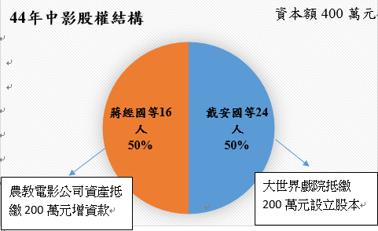

(二)52年間，中影公司逕於公司股東名簿上將農教電影公司除名，其股份則直接登記予之前代表該公司之自然人名下5，故中影公司所有股份均登記為自然人。53年間，該公司共增資6,600萬元，其中資本公積轉增資3,600萬元，直接登記於蔡孟堅等41人名下，另台灣銀行則以債作股取得3,000萬元股份6。

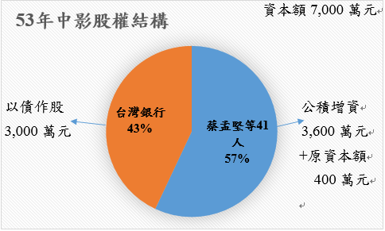

(三)60年以前，中影公司每年營運盈虧互見，43年度至58年度期間合計盈餘為5萬8,111元，期間曾出售大光明戲院、芳明戲院、世界戲院、中華戲院及共樂戲院等5家接收日產戲院，並以110萬元購置位於台北市士林區之中影文化城3,000坪土地，該段期間中影公司之收支狀況如下：

表一、中影公司損益（單位：（新台幣）元）

<table class="table table-bordered table-hover table-condensed">
  <thead>
    <tr>
      <th>年度(民國)</th>
      <th>收入</th>
      <th>支出</th>
      <th>損益</th>
      <th>備註</th>
    </tr>
  </thead>
  <tbody>
    <tr>
      <td>43</td>
      <td>3,748,268</td>
      <td>1,653,400</td>
      <td>2,094,868</td>
      <td> </td>
    </tr>
    <tr>
      <td>44</td>
      <td>12,335,021</td>
      <td>10,924,944</td>
      <td>1,410,976</td>
      <td>農教電影增資200萬</td>
    </tr>
    <tr>
      <td>45</td>
      <td>12,587,688</td>
      <td>12,535,575</td>
      <td>52,113</td>
      <td> </td>
    </tr>
    <tr>
      <td>46</td>
      <td>14,122,295</td>
      <td>13,219,836</td>
      <td>902,459</td>
      <td> </td>
    </tr>
    <tr>
      <td>47</td>
      <td>13,959,876</td>
      <td>13,755,426</td>
      <td>204,449</td>
      <td> </td>
    </tr>
    <tr>
      <td>48</td>
      <td>13,788,076</td>
      <td>15,347,179</td>
      <td>-1,559,103</td>
      <td> </td>
    </tr>
    <tr>
      <td>49</td>
      <td>18,010,343</td>
      <td>18,538,740</td>
      <td>-528,396</td>
      <td> </td>
    </tr>
    <tr>
      <td>50</td>
      <td>17,908,402</td>
      <td>18,812,889</td>
      <td>-904,487</td>
      <td> </td>
    </tr>
    <tr>
      <td>51</td>
      <td>22,045,471</td>
      <td>23,002,385</td>
      <td>-956,914</td>
      <td> </td>
    </tr>
    <tr>
      <td>52</td>
      <td>25,164,524</td>
      <td>26,359,733</td>
      <td>-1,195,208</td>
      <td> </td>
    </tr>
    <tr>
      <td>53</td>
      <td>28,943,068</td>
      <td>29,330,793</td>
      <td>-387,725</td>
      <td>增資6,600萬</td>
    </tr>
    <tr>
      <td>54</td>
      <td>37,830,498</td>
      <td>37,534,354</td>
      <td>296,143</td>
      <td>購置中影文化城土地</td>
    </tr>
    <tr>
      <td>55</td>
      <td>40,996,536</td>
      <td>40,777,977</td>
      <td>218,558</td>
      <td> </td>
    </tr>
    <tr>
      <td>56</td>
      <td>47,524,631</td>
      <td>47,262,136</td>
      <td>262,494</td>
      <td> </td>
    </tr>
    <tr>
      <td>57</td>
      <td>59,892,619</td>
      <td>59,815,370</td>
      <td>77,249</td>
      <td> </td>
    </tr>
    <tr>
      <td>58</td>
      <td>66,691,143</td>
      <td>66,620,508</td>
      <td>70,635</td>
      <td> </td>
    </tr>
    <tr>
      <td>合計</td>
      <td> </td>
      <td> </td>
      <td>58,111</td>
      <td> </td>
    </tr>
  </tbody>
</table>

(四)63年間，中影公司依中國國民黨文工會指示，將該公司內部「文工會往來」會計科目中，以「稽查費」名義列帳之歷年累計積欠「黨務經費」1,600萬元轉作黨股增資，向經濟部申請增資發行新股1,600萬元股份給予中國國民黨7：

1. 當時經濟部商業司承辦人認有疑義，以「股東為便稽查公司業務帳目，應依公司法第215條規定辦理，若係上級派員稽查，似為本於職權，反而收取稽查費，亦非所宜，若以股東身分行使檢查權，而收取檢查費，以之轉作資本，將嚴重影響資本不實。本案情形雖屬特殊，似不宜開此先例，擬予駁回，不予登記」書面上陳。

2. 中國國民黨文工會隨即以中影公司所具書面向經濟部次長劉師誠說明：「中影公司之前身為農業教育電影公司及台灣電影公司於43年9月合併而成隸屬於本黨（中國國民黨）經營事業受中央財務委員會之管理與督導合併之初之臺影公司原屬省黨營事業依期成規每月應提撥新台幣二十萬元交由省黨部充作黨務經費之用，然因未便以黨務經費項目明列公司賬目，故即以「稽查費」子目稱之，本公司成立後，因需向中央提撥「協款」，其性質與「稽查費」相同，故延用該子目繼續提撥，對方科目列”財務委員會往來”，文經會時期則轉列”文經會往來”，鈞會成立後因隸屬改變，即轉列”文工會往來”…該項往來經歷年累積截至58年時帳面金額已達新台幣一千六百餘萬元，當時因公司虧損甚鉅，即簽准停止提撥……本公司曾於<62>中影董公會字第0999號代電請准以”文工會往來”科目餘額沖抵累積虧損，嗣<62>文七字第0327號代電指示，應研究作為黨股增資處理，復以<62文七字第0329號代電准將積欠稽查費即”文工會往來”科目內撥出新台幣1,600萬元作為本公司黨股增資一案，准予備查」8。

3. 事後經濟部次長劉師誠即於前開簽呈述明「所謂『稽查費』，經洽中央文工會吳主任，以前派人前往稽查而收取費用，乃歷年對中央提撥協款之餘額，此一餘額既未提取，當屬中央對該公司之債權。轉為增資，於法應無不當，附文工會附來說明一件（置於簽後）」，指示同意上開增資1,600萬元登記。

4. 故經濟部即依批示，於64年2月3日以經（64）商06259號函回復中影公司，同意該等增資登記。

該公司增資後股權結構如下

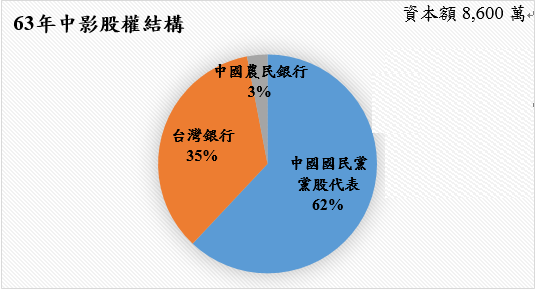

(五)67年度中影向經濟部商業司變更董監事登記申請書提及「本公司係黨營文化事業所有董監事均無薪給，亦無實際股權僅為股權代表人。凡代黨股者，自中央提報中常會核備後再由中央文化工作會派任之…」顯見中影公司之自然人股東僅係中國國民黨之黨股代表，當時中國國民黨不僅掌控該公司多數股權，更透過董監事掌控中影公司業務9。

(六)81年間，中影公司全部自然人股東將合計持有之62%股份移轉予華夏投資股份有限公司（下稱華夏投資公司）所有，故華夏投資公司成為中影公司最大股東10，另台灣銀行及中國農民銀行則分別持有中影35%及3%股份。

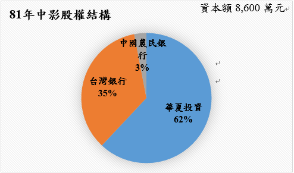

(七)87年間中影公司現金增資1億1,200萬元，因台灣銀行及中國農民銀行放棄認購，故增資部分多由華夏投資、中央投資公司（下稱中投公司）及建華投資股份有限公司（下稱建華投資公司）等關係企業認購11，並有少數中影公司員工參與。

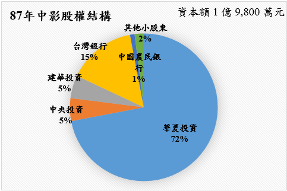

(八)嗣後陸續資本公積轉增資並有部分股東移轉中影股權，至93年7月，中影股權分別由華夏投資持有50%、台灣銀行持有15%、中國廣播股份有限公司（下稱中廣公司）持有15%、其餘股權由中國農民銀行、中投公司及其他小股東持有12。

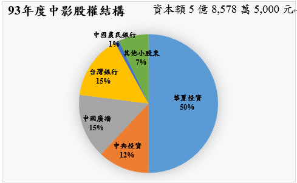

(九)94年間，中國國民黨將其所持有之華夏投資全部股權（佔華夏投資之99.6%股權）分別出售予光華投資股份有限公司（下稱光華公司）13、中投公司各143,415仟股（60%股權）及95,625仟股（39.6%股權），買賣價金共38億2,465萬元14。94年12月底，中投及光華公司將華夏公司（含中影50%股權、中廣97%股權及中視33.94%股權）以40億元出售予榮麗投資公司，股權並先過戶，惟該交易嗣後變更，雙方洽定交易標的限縮為附有中視公司33.94%股權之華夏公司，至華夏公司所有之中影公司50%及中廣公司97%股權則由中投公司另行處分。

(十)95年初，華夏公司將50%中影股權出售予中投等公司15，中投公司再將中投、中廣、光華、建華及中央日報社等關係企業全部持有的82.56%中影股權於95年4月27日以31億4,368萬8,210元16價格出售予莊婉均與羅玉珍（郭台強配偶），並約定支付簽約金1.5億元，餘款分期給付，股票則依各期款項比例分期過戶，雙方並約定由華夏公司先行依莊、羅2人之意指定3人擔任董監事以經營中影公司。

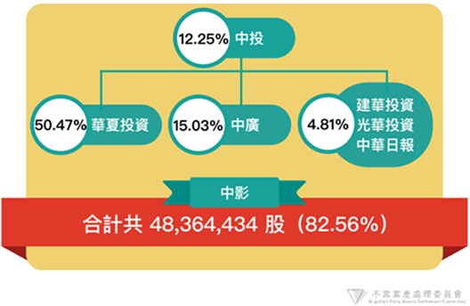

(十一)95年4月底，莊、羅2人先行支付簽約金1.5億元後，華夏公司依莊羅之意指派蔡正元任董事長兼總經理，莊婉均任副董事長，95年5月29日莊婉均支付第一期4.5億元股款，中投等公司即依約將中影公司8,768仟股及462仟股共16%中影股權分別過戶予莊婉均指定之阿波羅投資股份有限公司（下稱阿波羅投資公司）及茸國國際投資股份有限公司（下稱茸國公司）17。

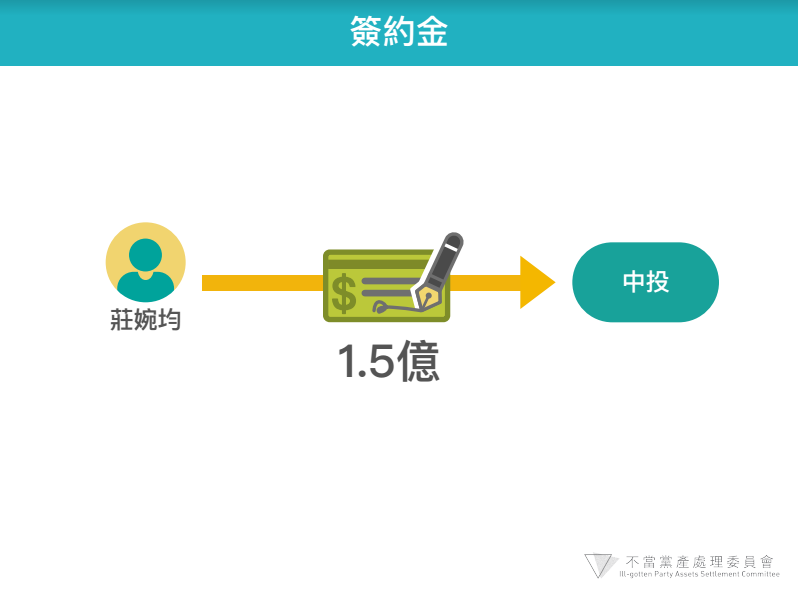

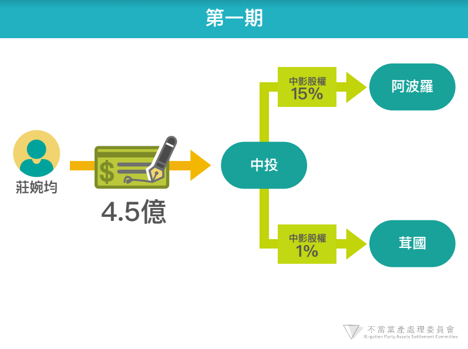

(十二)莊婉均因資力不足以支付第二期款6億元，遂將中影公司貸得款項6億元以台支方式支付予中投等公司，並要求中投等公司將中影公司股票8,800仟股、430仟股共16%中影股權分別過戶予阿波羅投資公司及茸國公司，其餘2萬4,868仟股股票共42%中影股權亦先行過戶予阿波羅投資公司，惟以設質方式由中投公司保管18。

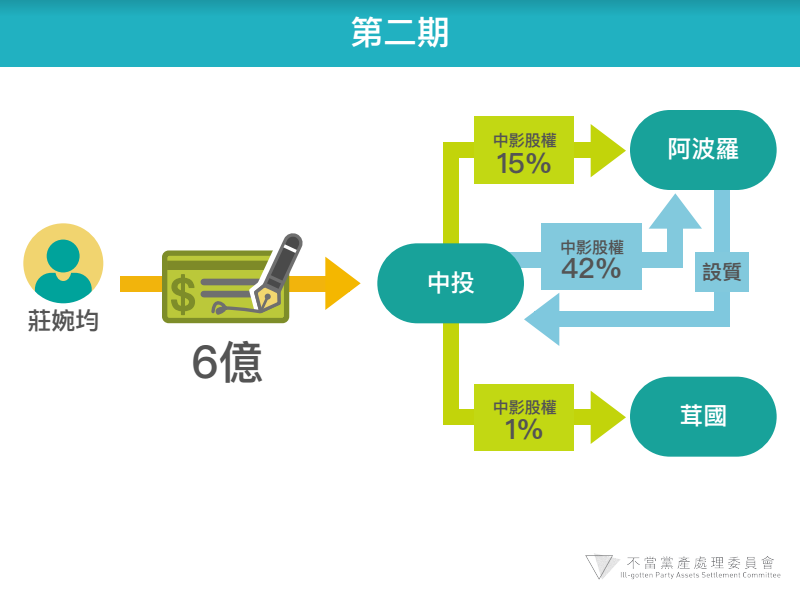

(十三)95年6月中影公司在蔡正元、莊婉均主導下辦理現金增資收回特別股、資本公積轉增資、現金減資19等案，惟台銀反對，並95年7月向法院提起訴訟，中投公司復向法院提告，要求莊婉均返還中影公司之7.5億元20，台北地檢署並介入偵辦。

(十四)96年1月蔡正元以中影公司減資款5.8億元，加上阿波羅投資公司向清晞電子股份有限公司（下稱清晞電子公司）借款1.3億元，另自籌4,000萬元歸還前述莊婉均款項。前述交易第三期以後款項由羅玉珍支付（郭台強背書）21，96年6月12日開立票據支付17億4,368萬8,000元之股款並取得42%中影股權22。96年7月蔡正元並將阿波羅投資公司持有之19%中影公司股權1,110萬股以5億7,720萬元價格出售予清晞電子公司23。

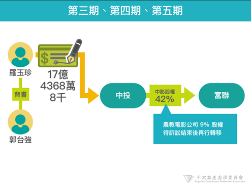

(十五)98年2月郭台強接任董事長24，富聯國際持有之股權共42%25。農教案部分之9%中影股權於99年敗訴確定，98年度該9%中影股權仍屬中投名下。98年11月中影將華夏大樓資產分割成立中影八德股份有限公司，資本額22億3,416萬元，負責人為郭台強。

(十六)99年間，中投將73億餘元資產及3億餘元負債分割成立欣裕台股份有限公司（下稱欣裕台公司），並將其對中影股權買受人莊婉均、羅玉珍等人之權利移轉予欣裕台公司26。

(十七)103年度中影資本公積轉增資1億1,715萬7,000元，資本額為7億294萬2,000元27。

(十八)104年中影現金增資4億元後資本額約11億28，股權結構為富聯國際37%、崴強科技4%、清晞電子18%、香港商傑麗發展有限公司11%、富士臨國際投資14%、台灣銀行14%、合作金庫1%、欣裕台0.11%，其餘約2%為其他小股東持有。105年度股權結構同104年度。

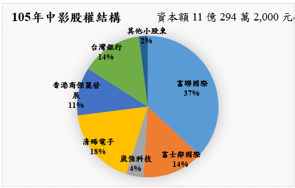

## 二、中投出售中影約定

### (一)中影資產價值

94年間，中影公司辦理資產重估作業，就該公司名下固定資產辦理資產重估，依據中影公司之財務資料，流動資產12億5,626萬元，基金及長期投資4億366萬元，固定資產58億3,209萬元，負債33億5,939萬元，股本5億8,578萬元，股東權益（淨值）42億5,364萬元，詳細財務資料略如下29：

表二、中影94年度資產負債表科目揭露（單位：元）

<table class="table table-bordered table-hover table-condensed">
  <thead>
    <tr>
      <th colspan="2">資產</th>
      <th colspan="2">負債與股東權益</th>
    </tr>
  </thead>
  <tbody>
    <tr>
      <td>流動資產</td>
      <td>12億5,626萬</td>
      <td>流動負債</td>
      <td>19億6,446萬</td>
    </tr>
    <tr>
      <td>基金及長期投資</td>
      <td>4億 366萬</td>
      <td>長期負債</td>
      <td>6億1,800萬</td>
    </tr>
    <tr>
      <td>固定資產</td>
      <td>58億3,209萬</td>
      <td>其他負債</td>
      <td>12億7,692萬</td>
    </tr>
    <tr>
      <td> </td>
      <td>（餘略）</td>
      <td>負債</td>
      <td>33億5,938萬</td>
    </tr>
    <tr>
      <td> </td>
      <td> </td>
      <td>股本</td>
      <td>5億8,578萬</td>
    </tr>
    <tr>
      <td> </td>
      <td> </td>
      <td>股東權益</td>
      <td>42億5,364萬</td>
    </tr>
    <tr>
      <td>總資產</td>
      <td>81億1,302萬</td>
      <td> </td>
      <td> </td>
    </tr>
  </tbody>
</table>

### (二)固定資產明細與價值

該公司固定資產包括位於大台北地區之新世界大樓、中影文化城、華夏大樓、梅花戲院及新北市新店區土地，以及位於嘉義市之舊嘉義戲院大樓、位於台南市之舊延平戲院大樓、位於屏東市之光華戲院，等土地及建物，已於94年間辦理資產重估，扣除折舊及提列土地增值稅準備之淨額為48億3,473萬元；惟依中華徵信所當時就新世界大樓、中影文化城、華夏大樓等三處大樓所為鑑價，扣除當時土地增值稅後，價值合計為64.85億元，已超過全部固定資產帳面價值16億餘元，該差額尚未包括位於台北市區之梅花戲院等，顯然中影公司之市場價值較94年度財務報告之淨值高出甚多。

表三、中影出售前固定資產明細30 單位：元/平方公尺

<table class="table table-bordered table-hover table-condensed">
  <thead>
    <tr>
      <th>固定資產</th>
      <th>土地面積(平方公尺)</th>
      <th>建物面積(平方公尺)</th>
      <th>95年土地公告現值</th>
      <th>鑑估價值（稅後）</th>
    </tr>
  </thead>
  <tbody>
    <tr>
      <td>新世界大樓</td>
      <td>1,441.32</td>
      <td>11,087.60</td>
      <td>6億5,544萬元</td>
      <td>14億8,258萬元</td>
    </tr>
    <tr>
      <td>中影文化城</td>
      <td>42,181.82</td>
      <td>8,221.49</td>
      <td>23億6萬元</td>
      <td>30億114萬元</td>
    </tr>
    <tr>
      <td>華夏大樓</td>
      <td>5,580.17</td>
      <td>27,702.48</td>
      <td>9億2,631萬元</td>
      <td>20億169萬元</td>
    </tr>
    <tr>
      <td>嘉義戲院</td>
      <td>661.16</td>
      <td>4,082.64</td>
      <td>9,497萬元</td>
      <td> </td>
    </tr>
    <tr>
      <td>壽星戲院</td>
      <td>519.01</td>
      <td>4,581.82</td>
      <td>2,460萬元</td>
      <td> </td>
    </tr>
    <tr>
      <td>光華戲院</td>
      <td>1,682.64</td>
      <td>9,494.21</td>
      <td>9,676萬元</td>
      <td> </td>
    </tr>
    <tr>
      <td>新生戲院</td>
      <td>333.88</td>
      <td>935.54</td>
      <td>1,236萬元</td>
      <td> </td>
    </tr>
    <tr>
      <td>梅花戲院</td>
      <td>145.45</td>
      <td>1,361.98</td>
      <td>6,563萬元</td>
      <td> </td>
    </tr>
    <tr>
      <td>延平戲院</td>
      <td>439.67</td>
      <td>4,155.37</td>
      <td>5,935萬元</td>
      <td> </td>
    </tr>
    <tr>
      <td>新店沖印場</td>
      <td>5,441.32</td>
      <td>1,239.67</td>
      <td>8,596萬元</td>
      <td> </td>
    </tr>
    <tr>
      <td>康定路宿舍</td>
      <td>52.89</td>
      <td>62.81</td>
      <td>－</td>
      <td> </td>
    </tr>
    <tr>
      <td>嘉興街宿舍</td>
      <td>52.89</td>
      <td>125.62</td>
      <td>－</td>
      <td> </td>
    </tr>
    <tr>
      <td>合計</td>
      <td>58,532.23</td>
      <td>73,051.24</td>
      <td>41億1,050萬元帳面價值48億3,473萬元31</td>
      <td>64億8,541萬元</td>
    </tr>
    <tr>
      <td> </td>
      <td> </td>
      <td> </td>
      <td> </td>
      <td> </td>
    </tr>
  </tbody>
</table>

### (三)中影股權之股價評估

95年4月間，中投公司委由衡平資產鑑定有限公司（下稱衡平公司）鑑估中影公司價值，衡平公司以中影公司94年度財務報告淨值為基準，自行折價81%作為估計中值，再以上下5%，即淨值76%至86%之作為鑑估區間，得出中影公司每股為60.8元至67.2元32。事後中投等公司遂依據此一鑑價報告，將該公司與光華投資、中廣公司等關係企業合計82.65%中影公司股權以31億4,368萬8,210元價格出售予蔡正元推介之莊婉均及羅玉珍（下稱買方）。

表四、中影出售淨值、評估價值與合約價金比較

<table class="table table-bordered table-hover table-condensed">
  <thead>
    <tr>
      <th>FIELD1</th>
      <th>公司價值</th>
      <th>82.56%股權價值</th>
      <th>資料來源</th>
    </tr>
  </thead>
  <tbody>
    <tr>
      <td>淨值</td>
      <td>42億5,364萬元</td>
      <td><strong>35億1,180萬元</strong></td>
      <td>94年度中影財報（每股72.49元）</td>
    </tr>
    <tr>
      <td>評估價值</td>
      <td>35億6,172萬元至39億3,664萬元</td>
      <td>29億4,056萬元至32億5,501萬元</td>
      <td>鑑價結果（每股60.8元至67.2元)</td>
    </tr>
    <tr>
      <td>合約價金</td>
      <td>38億776萬元</td>
      <td><strong>31億4,368萬8,210元</strong></td>
      <td>合約價格</td>
    </tr>
  </tbody>
</table>

### (四)股權買賣契約利潤分享條款

上開中投出售中影予買方莊婉均、羅玉珍所簽立之股權買賣契約書中，同時訂有「特別約定利潤分享條款」33：簽約日（95年4月27日）起3年內，若中影公司處分華夏大樓、新世界大樓與中影文化城不動產3處不動產之淨價加上土地增值稅分別高於15億元、12億元及26億元，買方應就華夏大樓超出部分之82.56%支付予中投；就新世界大樓超出部分之82.56%乘以三分之二支付予中投；就中影文化城部分超出82.56%乘以二分之一支付予中投。若3年內中影公司未處分上開3處不動產，則中投等公司有權以15億元12億元及26億元向中影公司購回。

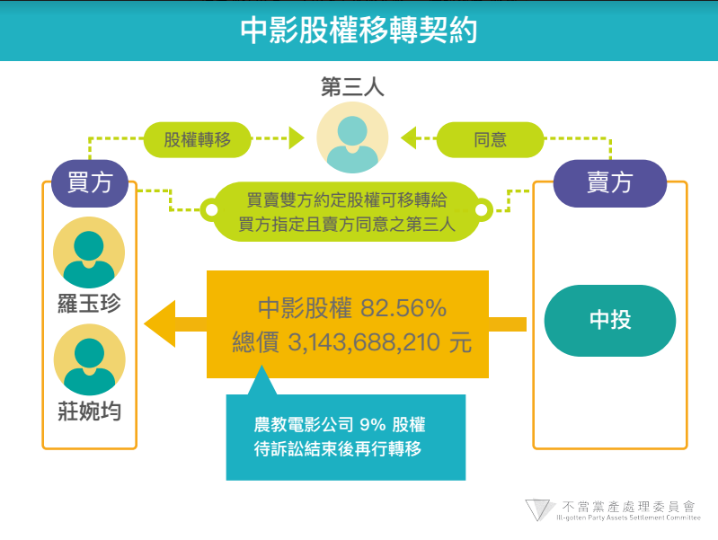

### (五)利潤分享條款實行現況

中投與莊婉均、羅玉珍約定之利潤分享條款期限3年，然3年期滿後買方未出售此條款約定之華夏大樓、新世界大樓與中影文化城。目前此利潤分享條款透過中投分割成立之欣裕台公司訴訟進行中。

## 三、中影接收日產戲院部分　　

36年1月27日至2月9日間台灣省行政長官公署將大世界戲院等19家日產戲院移交給中國國民黨台灣省黨部接管34，42年間中影公司成立，承接其中之大世界戲院、新世界戲院、大光明戲院、芳明戲院、新生戲院、台中戲院、嘉義戲院、延平戲院、世界戲院、光華戲院、中華戲院、光復戲院、壽星戲院、共樂戲院等14家日產戲院繼續經營35。其取得及移轉概況如下表：

表五、中影接收日產戲院來源與移轉後流向整理

<table class="table table-bordered table-hover table-condensed">
  <thead>
    <tr>
      <th>日產戲院</th>
      <th>地點</th>
      <th>土地取得時間</th>
      <th>來源</th>
      <th>移轉時間</th>
      <th>對象</th>
    </tr>
  </thead>
  <tbody>
    <tr>
      <td>大世界戲院</td>
      <td>台北</td>
      <td>45年</td>
      <td>台灣省財政廳</td>
      <td>86年</td>
      <td>豐園建設</td>
    </tr>
    <tr>
      <td>新世界戲院</td>
      <td>台北</td>
      <td>45年</td>
      <td>台灣省財政廳</td>
      <td>—</td>
      <td> </td>
    </tr>
    <tr>
      <td>大光明戲院</td>
      <td>台北</td>
      <td>45年</td>
      <td>公有財產處</td>
      <td>46年</td>
      <td>大光明歌劇公司</td>
    </tr>
    <tr>
      <td>芳明戲院</td>
      <td>台北</td>
      <td>45年</td>
      <td>台灣省財政廳</td>
      <td>50年</td>
      <td>吳永言</td>
    </tr>
    <tr>
      <td>新生戲院</td>
      <td>羅東</td>
      <td>48年</td>
      <td>羅東劇場株式會社</td>
      <td>93年</td>
      <td>尤博生</td>
    </tr>
    <tr>
      <td>嘉義戲院</td>
      <td>嘉義</td>
      <td>45年</td>
      <td>公有財產處</td>
      <td>—</td>
      <td>73年間部分轉售</td>
    </tr>
    <tr>
      <td>世界戲院</td>
      <td>台南</td>
      <td>45年</td>
      <td>台灣省財政廳</td>
      <td>57年</td>
      <td>方俊仁</td>
    </tr>
    <tr>
      <td>光華戲院</td>
      <td>屏東</td>
      <td>46年</td>
      <td>公有財產處</td>
      <td>—</td>
      <td>部分由屏東市公所徵收</td>
    </tr>
    <tr>
      <td>中華戲院</td>
      <td>花蓮</td>
      <td>45年</td>
      <td>台灣省財政廳</td>
      <td>48年</td>
      <td>陳彩錦</td>
    </tr>
    <tr>
      <td>光復戲院</td>
      <td>高雄</td>
      <td>45年</td>
      <td>台灣省財政廳</td>
      <td>91年</td>
      <td>郭振益、高雄市政府</td>
    </tr>
    <tr>
      <td>壽星戲院</td>
      <td>高雄</td>
      <td>43年</td>
      <td>鹽埕劇場株式會社</td>
      <td>—</td>
      <td>70年間部分轉售中國國民黨</td>
    </tr>
    <tr>
      <td>台中戲院36</td>
      <td>台中</td>
      <td>66年</td>
      <td>台中市政府</td>
      <td>—</td>
      <td> </td>
    </tr>
    <tr>
      <td>延平戲院37</td>
      <td>台南</td>
      <td>65年</td>
      <td>台南市政府</td>
      <td>—</td>
      <td> </td>
    </tr>
    <tr>
      <td>共樂戲院38</td>
      <td>高雄</td>
      <td colspan="2">中影取得日籍股東1283股</td>
      <td>56年</td>
      <td>翁宗護</td>
    </tr>
  </tbody>
</table>

中影公司於46年至57年期間陸續將大光明戲院、芳明戲院、世界戲院、中華戲院及共樂戲院等5家戲院之土地、建物或股權移轉予他人，其中共樂戲院股權係以每股185元價格出售予台南人翁宗護，得款23萬7,000餘元39。86年間，中影公司另將大世界戲院土地出售予關係企業豐園建設公司，得款近10億元40。91年間光復戲院土地由高雄市政府徵收為捷運使用，徵收補償費1億1,735萬元41。

92年間仍登記為中影公司所有之日產戲院尚有新世界、嘉義、壽星、光華、新生、台中及延平等7家戲院，其中新世界、嘉義、壽星、光華及新生戲院土地合計13筆，面積4,683平方公尺；93年間，行政院國家資產經營管理委員會黨產處理專案小組三度與中國國民黨協商，要求原物返還尚登記於中影公司名下之新世界、嘉義、壽星、光華及新生等5家戲院房地，或按該等戲院當期土地公告現值9億1,500萬元加4成之金額合計12億8,100萬元返還國庫，惟中國國民黨不願原物返還，僅表示願意返還3億4,491萬9,428元42，惟於協商期間逕將新生戲院房地出售，得款約5,800萬元43，復於95年間將中影公司股權全數出售，中影公司迄未就前開接收之14家戲院歸還任何款項或土地、建物予國家。

目前中影公司名下尚持有之接收日產戲院計有新世界戲院、嘉義戲院、光華戲院、壽星戲院、台中戲院及延平戲院等6家戲院，105年合計公告現值約為16億5,607萬8,380元：

表六、本次調查之日產戲院105年度土地建物面積與公告現值

<table class="table table-bordered table-hover table-condensed">
  <thead>
    <tr>
      <th>戲院名稱</th>
      <th>土地面積44(平方公尺)</th>
      <th>建物面積45(平方公尺)</th>
      <th>105年土地公告現值46(元)</th>
      <th>備註</th>
    </tr>
  </thead>
  <tbody>
    <tr>
      <td>新世界戲院</td>
      <td>1,441</td>
      <td>10,209</td>
      <td>1,314,346,187</td>
      <td>全部持有</td>
    </tr>
    <tr>
      <td>嘉義戲院</td>
      <td>811</td>
      <td>4,267</td>
      <td>107,222,895</td>
      <td>中影持分8,166/10,000</td>
    </tr>
    <tr>
      <td>光華戲院</td>
      <td>1,684</td>
      <td>9,880</td>
      <td>110,287,782</td>
      <td>全部持有</td>
    </tr>
    <tr>
      <td>壽星戲院</td>
      <td>1,841</td>
      <td>4,487</td>
      <td>30,111,396</td>
      <td>中影持分1,410/5000</td>
    </tr>
    <tr>
      <td>台中戲院</td>
      <td>1,874</td>
      <td>3,490.44</td>
      <td>25,685,406</td>
      <td>中影持分22,572/10,000</td>
    </tr>
    <tr>
      <td>延平戲院</td>
      <td>2,040.22</td>
      <td>3,405</td>
      <td>68,424,714</td>
      <td>中影持分2,158/10,000</td>
    </tr>
    <tr>
      <td>合 計</td>
      <td>9691.22</td>
      <td>39415.44</td>
      <td>1,656,078,380</td>
      <td> </td>
    </tr>
  </tbody>
</table>

### (一)新世界戲院

新世界大樓原名為「新世界館」，位於現今台北市萬華區漢中街116號及成都路13號，總面積為1,441平方公尺47，40年間由台灣省公產管理處接管，43年7月20日國防最高委員會第227次會議核准轉帳予中央電影事業股份有限公司48，並於45年8月22日登記於中影名下49。

56年間中影公司出資3,500萬改建新世界戲院，目前為地下1層，地上9層的西門町新世界商業大樓50，建物總面積為10,209.29平方公尺。中影公司持有全部產權51。

96年12月，財政部國有財產局就新世界戲院基地，向法院訴請中影返還土地，惟歷審法院均依時效完成為由判決中影公司勝訴52，惟一審承審法官亦曾認為：「...基於法律安定之考量，或時效或除斥期間均已經過，且可能涉及第三人已取得之權益，故實務上有其困難，為符合實質法治國之原則，唯一可行之道似為以特別立法方式，課予中國國民黨歸還上開財產之義務」53。

該大樓曾於95年間由中華徵信所進行鑑價，扣除土地增值稅後之土地及建物鑑估價格合計11億4,991萬元，105年之土地公告現值則為12億8,698萬元。目前該大樓7樓由中影公司自行經營作為真善美劇院使用，餘樓層均出租予他人使用，另依前開95年間中投公司與莊婉均與羅玉珍交易合約之利潤分享條款，日後中影公司出售該大樓（含土地增值稅）超過12億之價款部分，應乘以82.56%乘以二分之一支付予中投。

### (二)嘉義戲院

嘉義戲院為「嘉義座」，土地總面積為811平方公尺54，現址為嘉義市西區文化路155號，38年2月由台灣省公產管理處接管55，45年7月時由台灣省公產管理處移轉登記予中央電影事業股份有限公司名下56，並由中影公司經營。

68年間嘉義戲院發生火災，中影取得火損理賠約300萬元，隨即以該土地與聰義企業公司合建商場大樓，取得逾3,600萬元現金停業補償金及新大樓4至8層建物及地下2層停車場產權，建物面積為4267.71平方公尺57，當時總價值逾1億元58。該戲院目前公告土地現值合計為1億722萬元。

### (三)光華戲院

屏東光華戲院原名「末廣館」，位於現今屏東市民生路248號，接收時占地2543平方公尺59。民國41年11月時由台灣省公產管理處接管，46年3月由中國國民黨轉帳撥歸並登記於中央電影事業股份有限公司名下60。

77年至81年間，該戲院部分土地由屏東市公所徵收61，土地總面積縮減為目前的1,684平方公尺。90年間改建完後成為地下2層，地上5層的建築，建物總面積為9,880.85平方公尺。目前中影公司將該大樓1、2樓出租，餘樓層由中影公司經營使用。目前屏東戲院土地公告現值合計約1億1,000萬元。

### (四)壽星戲院

高雄壽星戲院原名壽星座，現址為高雄市鹽埕區七賢三路241號，占地1,841平方公尺62。36年10月所有權人為鹽埕劇場株式會社63，47年4月時再由政府轉帳予中央電影股份有限公司64，並持續經營。

中影公司於65年前後與瑞鋒營造廠合建為壽星商業大樓65，落成後分回第1層、第6層、第7層建物，合計5,544.38平方公尺；70年間，該公司復將該大樓其中第6層全部360坪（約1,190平方公尺）房地，以每坪6萬2,000元價格出售予中國國民黨，得款2,232萬元66。

84年間戲院歇業迄今。該戲院土地1841平方公尺由中影公司持分1,410/5,00067，公告現值為每平方公尺為58,000元，總額為3,011萬元，另中影持有建物面積4,487平方公尺。該棟大樓目前未做任何使用。

### (五)台中戲院

台中戲院原名「台中座」，現址在台中市中區台灣大道一段138號，占地1,874平方公尺，建物面積3490.44平方公尺68，係當年台中第一家戲院。36年間台灣行政長官公署將該戲院建物移交中國國民黨，惟土地則由台中市政府接收，嗣後中國國民黨將台中戲院移交給中影公司繼續經營，然而戲院建物並未登記69。

66年間，中影公司決定改建該戲院為商業大樓，約定由康橋建設股份有限公司出具價購土地所需之1億4,430萬元及所需營造資金，中影公司隨於67年間向台中市政府價購得該戲院用地，再交予康橋公司興建70，中影公司從中取得合建權益逾1億3,500萬元。

中影目前持有大樓建物1樓至5樓及地下3樓停車場，建物總面積共3,490平方公尺，土地1,874平方公尺（中影持分為之22,572/100,000，105年的公告土地現值為每平方公尺60,722元，公告現值總額為2,568萬元。

### (六)延平戲院

延平戲院原名「宮古座」，現址在台南市中西區西門路二段120號，占地2,040.22平方公尺71，36年間該戲院建物由中國國民黨接收使用，再轉由中影公司經營使用，土地則由台南市政府於光復後辦理登記72。

64年間中影公司為改建戲院為商業大樓，遂先與台南市政府辦理租用土地，隨即於65年7月向台南市政府價購戲院用地73，並交由延平建設公司合作改建成11層大樓，並分得第4層、第5層樓及地下二樓停車場，建物面積合計3,405平方公尺，當時價值逾1億元74。

目前中影公司土地（持分2,040平方公尺之2,158/10,000），公告現值總額為6,842萬4,714元。

附表A資本額變化與股權結構變動一覽表（民國42年至民國93年）
<table class="table table-bordered table-hover table-condensed">
  <thead>
    <tr>
      <th>時間</th>
      <th>實收資本額</th>
      <th>股權結構變動原因</th>
      <th>變動方式</th>
      <th>股權結構</th>
      <th>持股比例</th>
    </tr>
  </thead>
  <tbody>
    <tr>
      <td>民國42年</td>
      <td>200萬元</td>
      <td>設立登記</td>
      <td>以台北大世界戲院基地及房屋抵繳</td>
      <td>戴安國等22人</td>
      <td>100%</td>
    </tr>
    <tr>
      <td rowspan="2">民國44年</td>
      <td rowspan="2">400萬元</td>
      <td rowspan="2">增資200萬</td>
      <td rowspan="2">以農教電影公司資產抵繳之</td>
      <td>戴安國等24人</td>
      <td>50%</td>
    </tr>
    <tr>
      <td>農業教育電影（股）公司</td>
      <td>50%</td>
    </tr>
    <tr>
      <td rowspan="2">民國53年</td>
      <td rowspan="2">7,000萬元</td>
      <td rowspan="2">增資6,600萬元</td>
      <td rowspan="2">資本公積、固定資產、其他長期借款、向台銀透支之短期借款轉作資本</td>
      <td>蔡孟堅等41人</td>
      <td>57%</td>
    </tr>
    <tr>
      <td>台灣銀行</td>
      <td>43%</td>
    </tr>
    <tr>
      <td rowspan="3">民國63年</td>
      <td rowspan="3">8,600萬元</td>
      <td rowspan="3">－</td>
      <td rowspan="3">－</td>
      <td>辜振甫等51人</td>
      <td>62%</td>
    </tr>
    <tr>
      <td>台灣銀行</td>
      <td>35%</td>
    </tr>
    <tr>
      <td>中國農民銀行</td>
      <td>3%</td>
    </tr>
    <tr>
      <td rowspan="3">民國81年</td>
      <td rowspan="3">8,600萬元</td>
      <td rowspan="3">－</td>
      <td rowspan="3">－</td>
      <td>華夏投資</td>
      <td>62%</td>
    </tr>
    <tr>
      <td>台灣銀行</td>
      <td>35%</td>
    </tr>
    <tr>
      <td>中國農民銀行</td>
      <td>3%</td>
    </tr>
    <tr>
      <td rowspan="6">民國87年</td>
      <td rowspan="6">1億9,800萬元</td>
      <td rowspan="6">增資1億1,200萬元</td>
      <td rowspan="6">現金增資</td>
      <td>華夏投資</td>
      <td>72%</td>
    </tr>
    <tr>
      <td>中央投資</td>
      <td>5%</td>
    </tr>
    <tr>
      <td>建華投資</td>
      <td>5%</td>
    </tr>
    <tr>
      <td>台灣銀行</td>
      <td>15%</td>
    </tr>
    <tr>
      <td>中國農民銀行</td>
      <td>1%</td>
    </tr>
    <tr>
      <td>持股5%以下股東</td>
      <td>2%</td>
    </tr>
    <tr>
      <td rowspan="4">民國88年</td>
      <td rowspan="4">3億5,640萬元</td>
      <td rowspan="4">增資1億5,840萬元</td>
      <td rowspan="4">資本公積轉增資</td>
      <td>華夏投資</td>
      <td>72%</td>
    </tr>
    <tr>
      <td>台灣銀行</td>
      <td>15%</td>
    </tr>
    <tr>
      <td>中國農民銀行</td>
      <td>1%</td>
    </tr>
    <tr>
      <td>持股5%以下股東</td>
      <td>12%</td>
    </tr>
    <tr>
      <td rowspan="5">民國89年</td>
      <td rowspan="5">5億3,460萬元</td>
      <td rowspan="5">增資1億7,820萬元</td>
      <td rowspan="5">資本公積轉增資</td>
      <td>華夏投資</td>
      <td>50%</td>
    </tr>
    <tr>
      <td>中央投資</td>
      <td>27%</td>
    </tr>
    <tr>
      <td>台灣銀行</td>
      <td>15%</td>
    </tr>
    <tr>
      <td>中國農民銀行</td>
      <td>1%</td>
    </tr>
    <tr>
      <td>持股5%以下股東</td>
      <td>7%</td>
    </tr>
    <tr>
      <td rowspan="6">民國91年</td>
      <td rowspan="6">5億8,806萬元</td>
      <td rowspan="6">增資5,346萬元</td>
      <td rowspan="6">資本公積轉增資</td>
      <td>華夏投資</td>
      <td>50%</td>
    </tr>
    <tr>
      <td>中央投資</td>
      <td>12%</td>
    </tr>
    <tr>
      <td>中國廣播</td>
      <td>15%</td>
    </tr>
    <tr>
      <td>台灣銀行</td>
      <td>15%</td>
    </tr>
    <tr>
      <td>中國農民銀行</td>
      <td>1%</td>
    </tr>
    <tr>
      <td>持股10%以下股東</td>
      <td>5%</td>
    </tr>
    <tr>
      <td rowspan="6">民國93年</td>
      <td rowspan="6">5億8,578萬5000元</td>
      <td rowspan="6">減資227萬5,000元</td>
      <td rowspan="6">庫藏股註銷</td>
      <td>華夏投資</td>
      <td>50%</td>
    </tr>
    <tr>
      <td>中央投資</td>
      <td>12%</td>
    </tr>
    <tr>
      <td>中國廣播</td>
      <td>15%</td>
    </tr>
    <tr>
      <td>台灣銀行</td>
      <td>15%</td>
    </tr>
    <tr>
      <td>中國農民銀行</td>
      <td>1%</td>
    </tr>
    <tr>
      <td>持股10%以下股東</td>
      <td>7%</td>
    </tr>
  </tbody>
</table>

附表B資本額變化與股權結構變動一覽表（民國95年4月至民國96年6月）

<table class="table table-bordered table-hover table-condensed">
  <thead>
    <tr>
      <th>時間</th>
      <th>實收資本額</th>
      <th>資本額變更原因</th>
      <th>增資方式</th>
      <th>股權結構</th>
      <th>持股比例</th>
    </tr>
  </thead>
  <tbody>
    <tr>
      <td rowspan="6">民國95年4月 （中投出售中影前）</td>
      <td rowspan="6">5億8,578萬5,000元</td>
      <td rowspan="6">—</td>
      <td rowspan="6">—</td>
      <td>華夏投資</td>
      <td>50%</td>
    </tr>
    <tr>
      <td>中央投資</td>
      <td>12%</td>
    </tr>
    <tr>
      <td>中國廣播</td>
      <td>15%</td>
    </tr>
    <tr>
      <td>台灣銀行</td>
      <td>15%</td>
    </tr>
    <tr>
      <td>中國農民銀行</td>
      <td>1%</td>
    </tr>
    <tr>
      <td>持股5%以下股東</td>
      <td>7%</td>
    </tr>
    <tr>
      <td rowspan="6">民國95年7月（第二期款支付後）</td>
      <td rowspan="6">5億8,578萬5,000元</td>
      <td rowspan="6">—</td>
      <td rowspan="6">－</td>
      <td>阿波羅投資</td>
      <td>72%</td>
    </tr>
    <tr>
      <td>茸國國際投資</td>
      <td>2%</td>
    </tr>
    <tr>
      <td>中央投資</td>
      <td>9%</td>
    </tr>
    <tr>
      <td>台灣銀行</td>
      <td>15%</td>
    </tr>
    <tr>
      <td>中國農民銀行</td>
      <td>1%</td>
    </tr>
    <tr>
      <td>持股5%以下股東</td>
      <td>1%</td>
    </tr>
    <tr>
      <td rowspan="6">民國95年8月</td>
      <td rowspan="6">5億8,578萬5,000元</td>
      <td rowspan="6">現金增資3,000萬元</td>
      <td rowspan="6">現金增資部分購回台銀特別股</td>
      <td>阿波羅投資</td>
      <td>76%</td>
    </tr>
    <tr>
      <td>茸國國際投資</td>
      <td>2%</td>
    </tr>
    <tr>
      <td>中央投資</td>
      <td>9%</td>
    </tr>
    <tr>
      <td>台灣銀行</td>
      <td>10%</td>
    </tr>
    <tr>
      <td>中國農民銀行</td>
      <td>1%</td>
    </tr>
    <tr>
      <td>持股5%以下股東</td>
      <td>2%</td>
    </tr>
    <tr>
      <td rowspan="6">民國95年9月</td>
      <td rowspan="6">5億8,578萬5,000元</td>
      <td rowspan="6">資本公積轉增資7億6,152萬元並減資7億6,152萬元</td>
      <td rowspan="6">－</td>
      <td>阿波羅投資</td>
      <td>77%</td>
    </tr>
    <tr>
      <td>茸國國際投資</td>
      <td>1%</td>
    </tr>
    <tr>
      <td>中央投資</td>
      <td>9%</td>
    </tr>
    <tr>
      <td>台灣銀行</td>
      <td>10%</td>
    </tr>
    <tr>
      <td>中國農民銀行</td>
      <td>1%</td>
    </tr>
    <tr>
      <td>持股5%以下股東</td>
      <td>2%</td>
    </tr>
    <tr>
      <td rowspan="6">民國96年6月（剩餘款項支付後）</td>
      <td rowspan="6">5億8,578萬5,000元</td>
      <td rowspan="6">－</td>
      <td rowspan="6">－</td>
      <td>阿波羅投資</td>
      <td>35%</td>
    </tr>
    <tr>
      <td>中央投資</td>
      <td>9%</td>
    </tr>
    <tr>
      <td>茸國國際投資</td>
      <td>1%</td>
    </tr>
    <tr>
      <td>羅玉珍（富聯國際）</td>
      <td>42%</td>
    </tr>
    <tr>
      <td>台灣銀行</td>
      <td>10%</td>
    </tr>
    <tr>
      <td>持股5%以下股東</td>
      <td>3%</td>
    </tr>
    <tr>
      <td rowspan="6">民國96年7月</td>
      <td rowspan="6">5億8,578萬5,000元</td>
      <td rowspan="6">－</td>
      <td rowspan="6">－</td>
      <td>阿波羅投資</td>
      <td>16%</td>
    </tr>
    <tr>
      <td>中央投資</td>
      <td>9%</td>
    </tr>
    <tr>
      <td>清晞電子</td>
      <td>19%</td>
    </tr>
    <tr>
      <td>羅玉珍（富聯國際）</td>
      <td>42%</td>
    </tr>
    <tr>
      <td>台灣銀行</td>
      <td>10%</td>
    </tr>
    <tr>
      <td>持股5%以下股東</td>
      <td>4%</td>
    </tr>
    <tr>
      <td rowspan="5">民國103年</td>
      <td rowspan="5">7億294萬2,000元</td>
      <td rowspan="5">增資1億1,715萬7,000元</td>
      <td rowspan="5">資本公積轉增資</td>
      <td>富聯國際</td>
      <td>51%</td>
    </tr>
    <tr>
      <td>清晞電子</td>
      <td>19%</td>
    </tr>
    <tr>
      <td>香港商傑麗發展</td>
      <td>11%</td>
    </tr>
    <tr>
      <td>台灣銀行</td>
      <td>15%</td>
    </tr>
    <tr>
      <td>持股5%以下股東</td>
      <td>4%</td>
    </tr>
    <tr>
      <td rowspan="7">民國104年</td>
      <td rowspan="7">11億294萬2,000元</td>
      <td rowspan="7">現金增資4億元</td>
      <td rowspan="7">—</td>
      <td>富聯國際</td>
      <td>37%</td>
    </tr>
    <tr>
      <td>富士臨國際投資</td>
      <td>14%</td>
    </tr>
    <tr>
      <td>崴強科技</td>
      <td>4%</td>
    </tr>
    <tr>
      <td>清晞電子</td>
      <td>18%</td>
    </tr>
    <tr>
      <td>香港商傑麗發展</td>
      <td>11%</td>
    </tr>
    <tr>
      <td>台灣銀行</td>
      <td>14%</td>
    </tr>
    <tr>
      <td>持股5%以下股東</td>
      <td>2%</td>
    </tr>
  </tbody>
</table>

-----

1. 整理如第24頁以下之附表A及附表B。
2. 參見42年台灣電影事業股份有限公司董事監察股款報告書。
3. 參見台北市西門町二丁目二十一番地土地謄本。
4. 參見43年中央電影事業股份有限公司變更登記事項表股東名簿。
5. 農教電影公司後於95年訴請華夏及中影等公司返還股權，經台北地方法院95年重訴字第88號判決敗訴，台灣高等法院96年重上字380號及最高法院99年台上字第594號均駁回上訴而敗訴確定。

   二審判決並依據農教電影公司43年8月30日股東會議紀錄：「『列席人：中央財務委員會……乙、討論事項：……二本公司『奉命』與台影公司（即台灣電影公司）合併組織新公司案。決議：1.本公司以轉投資方式參加新公司。2.新公司登記資本額定為新台幣四百萬元，由本公司及台影公司各出資兩百萬元。……4.一俟新公司正式成立後，本公司即停止營業，由新公司接辦一切業務，所有債權債務仍自行清理……三推選參加新公司股權代表人案。決議：推選蔣經國、戴安國……等十七人為本公司參加新公司之股權代表人。……』」、中影公司52年3月20日第七屆股東大會會議紀錄之案由二（4）記載：「農教公司股份過去未以其公司法人名義出名，增資後擬如舊』，併此陳明。決議：通過。」，及農教電影公司於審判中所述「台灣電影公司係由國民黨中央委員會投資設立，亦屬黨營事業」，認定「……同屬黨營事業之上訴人（按：農教電影公司）於43年間原係奉命與台灣電影公司合併組織中影公司，並事先於43年8月30日股東會中推選其將來在中影公司之股權代表人。因上訴人係以200萬元轉投資於中影公司，股本占中影公司股本總額400萬元之50%，是其股權代表人應以中國國民黨黨員（下稱黨員）充任；雖上訴人未辦理合併，惟其既經股東會決議於43年8月31日中影公司成立後，即停止營業，自無再出名登記為中影公司法人股東之必要，事實上亦無法於日後再行指派法人股東之代表人，乃採用『推選參加中影公司股權代表人』之方式處理，遂將其轉投資所得股份登記在上開推選參加中影公司股權代表人之黨員名下，並由渠等行使股權」，故農教電影公司轉投資中影公司並非約定以其名義為股東，不得以其轉投資200萬元以抵繳股款，即認為農教電影公司為中影公司之股東。

6. 參見53年中央電影事業股份有限公司常駐監察人報告書。
7. 經濟部商業司64年1月7簽辦用箋。
8. 同前註，附於該用箋後。
9. 參見經濟部商業司67年9月14日經(67)商31062號函之附件：中影67年9月7日致經濟部商業司之變更董監事登記申請書。
10. 參見81年中影董枝秘字第0309號董事會函。
11. 參見87年8月5號中央電影事業股份有限公司股東名簿。
12. 參見93年中央電影事業股份有限公司股東名冊。
13. 94年光華投資為中投100%持股之子公司，參見94年中投公司財務報告書。
14. 參見中國國民黨、光華投資公司與中央投資公司之股份買賣契約。
15. 參見95年5月5日中投與華夏投資簽立股權買賣契約書及95年4月27日財政部證交稅繳款書。
16. 參見95年4月27日中投與莊婉均、羅玉珍股權買賣契約書。
17. 參見中央投資股份有限公司99年4月2日出具之「真相-中影股權交易案始末」報告，最高法院檢察署99年度特他字第3號偵查卷。
18. 同註17。
19. 參見最高法院檢察署99年度特他字第3號偵查卷。
20. 參見最高法院檢察署99年度特他字第3號偵查卷。
21. 參見中央投資股份有限公司94年度及95年度財務報告書，與96年6月11日中投與羅玉珍簽立之股權買賣契約書補充協議。
22. 參見羅玉珍96年6月12日領收股票收據，最高法院檢察署96年度查字第000004號偵查卷。
23. 參見98年2月17日中影第44屆董事會議議事錄及台北地方法院99年重訴字第551號民事判決。
24. 同註23。
25. 參見經濟部商業司98年3月19日經授商字第09801052890號變更登記表。
26. 參見中投公司與欣裕台公司99年5月4日簽訂之公司分割執行協議書。
27. 參見中影103年增資後股東名冊及103年度資本額查核報告書。
28. 參見中影104、105年股東名冊及104年度資本額查核報告書。
29. 參見中影95年度財務報告書。
30. 新世界大樓、中影文化城、華夏大樓中影於95年委託中華徵信所進行鑑價，參見衡平資產鑑定有限公司95年4月26日出具之「股權交易價格合理性評估報告書」。另嘉義戲院、壽星戲院、光華戲院、新生戲院、梅花戲院、延平戲院、新店沖印場、康定路宿舍與嘉興街宿舍相關土地建物坪數，參見96年6月12日洪再德會計師出具之中央電影事業股份有限公司會計師檢查報告書（91年度至95年度），最高法院檢察署99年度特他字第3號偵查卷。
31. 參見註21中影94年度財務報告書，固定資產細項中土地、重估增值與出租資產扣除建築物及出租資產折舊後之結果。
32. 同註30，參見衡平資產鑑定有限公司95年4月26日「股權交易價格合理性評估報告書」。
33. 同註16。
34. 參見中國國民黨黨史會，『光復台灣之籌劃與受降接收』，79年，頁460-461。
35. 該19家戲院中，已知蘇澳戲院因毀損故未接收，共樂戲院、南方常設館及新光戲院等3家戲院之土地未曾登記於中國國民黨及中影公司名下。本會依現調查資料，就14家中影公司繼續經營之戲院臚列之。
36. 臺中戲院建物由中央電影公司接收經營，土地仍登記在臺中市政府名下，故由中央電影公司向臺中市政府租用，66年間向臺中市政府價購後，隨即與第三人合建改建大樓。參見中影66年第19屆股東常會會議紀錄。
37. 延平戲院建物由中央電影公司接收經營，土地則於65年間始由中央電影公司向臺南市政府承租，中影公司隨於次（66）年間向臺南市政府價購後，並與建商合建改建大樓。
38. 共樂戲院於日治時代係由「株式會社岡山共樂館」經營，為日籍與台籍股東共有34年以後，該會社改組為「岡山戲院股份有限公司」，並持續經營，土地亦登記於該公司名下，中央電影公司則接收原有日籍股東持有之1,283股，而後再於56年12月1日將股權移轉予第三人翁宗護，參見行政法院81年度判字第1029號判決。
39. 同前註。
40. 該戲院土地合計1841平方公尺，當年公告現值每平方公尺294,927元，故總公告現值為542,953,243元，估計交易實價約10億元。
41. 參見高雄捷運橘線02車站出入口B公共建設用地價購清冊。
42. 參見行政院秘書長95年8月9日院臺法字字第0950090064號函之附件「續商追討政黨不當取得財產相關問題」會議結論。
43. 同註30，參見96年6月12日洪再德會計師出具之中央電影事業股份有限公司會計師檢查報告書（91年度至95年度），最高法院檢察署99年度特他字第3號偵查卷。
44. 土地係整個戲院所佔面積，並未以持分換算持有面積。
45. 建物與他人共有者，則依持分比率換算持有面積。
46. 土地與他人共有者，依持分比率計算持有面積再乘公告現值。
47. 原地號為西門町1丁目第3及3-1地號，當時面積分別為1,118平方公尺及289平方公尺，68年地籍重測，改編為台北市萬華福星段三小段455及456地號，土地總面積合計增為1,441平方公尺。參見財政部國產局93年11月9日台財產局接字第0930032091號會議資料。
48. 參見台北市萬華區福星段三小段455、456地號土地謄本。
49. 同前註。
50. 參見中央電影業股份有限公司57年2月5日第10屆股東大會會議紀錄。
51. 參見台北市萬華區福星段三小段建號603、604、605、606、607、608、609、610、611、612、613、2404建物謄本。
52. 參見台北地方法院96年重訴字第1712號民事判決、台灣高等法院100年度重上字第243號民事判決及最高法院102年度台上字第2344號民事裁定。
53. 台北地方法院96年重訴字1712號民事判決。
54. 嘉義戲院土地原為北門七丁目的19-1及19-2地號，當時面積分別為112平方公尺（19-1地號）及683平方公尺（19-2地號），合計795平方公尺；50年9月地籍圖重測後，改為北門段7小段19-1及19-2地號。面積分別為121平方公尺及690平方公尺，總面積為增為811平方公尺。參見財政部國產局93年11月9日台財產局接字第0930032091號會議資料，註47。
55. 參見嘉義市北門段七小段地號19-1、19-2土地謄本。
56. 同前註。
57. 土地部分，中影所有為8,166/10,000。建地部分，建號832中影所有為2,230/10,000，建號834中影所有為4,615/10,000。
58. 參見中央電影事業股份有限公司第21屆股東常會會議紀錄。
59. 原地號為屏東市小川1小段第21、21-1至21-8、21-12、21-14至21-16及21-19地號，地號後更名為屏東市楠樹腳1小段，面積並未改變。參見財政部國產局93年11月9日台財產局接字第0930032091號會議資料，註47。
60. 參見屏東市楠樹腳段一小段21地號土地謄本。
61. 同上註。
62. 原地號為高雄三丁目3-11、3-12、3-19、4、4-1、4-4、4-5，總面積為1948平方公尺。67年合併4地號為府北段3小段4地號，75年重測後改為目前的鹽壽段52地號，面積變更為1841平方公尺。參見財政部國產局93年11月9日台財產局接字第0930032091號會議資料，註47。
63. 參見高雄市鹽埕區鹽壽段51、52地號土地謄本。
64. 參見高雄市鹽埕區鹽壽段51、52地號土地謄本。
65. 參見中央電影事業股份有限公司第20屆股東常會會議紀錄。
66. 參見中央電影公司70年12月30日第23屆股東常會會議紀錄。
67. 參見高雄市鹽埕區鹽壽段97、99、102、103建號建物謄本。
68. 原地號為榮町4丁目，之後地號變更為台中市中區繼光段4小段1地號，面積為1874平方公尺。建物部分有520、524及525建號，面積為3490.44平方公尺，參見財政部國產局93年2月9日台財產接第0930003994號函「國家資產經營管理委員會黨產處理專案小組」第2次會議紀錄。
69. 參見財政部國產局93年2月9日台財產接第0930003994號函。
70. 參見中央電影事業股份有限公司第19屆股東常會會議紀錄。
71. 現地號為台南市中西區保西段394號。　
72. 參見註68，財政部國產局93年2月9日台財產接第0930003994號函。
73. 參見台南市政府府財產字第1051247772號函之說明。
74. 參見中央電影公司65年6月25日股東常會會議紀錄及67年6月19日股東常會會議紀錄。
